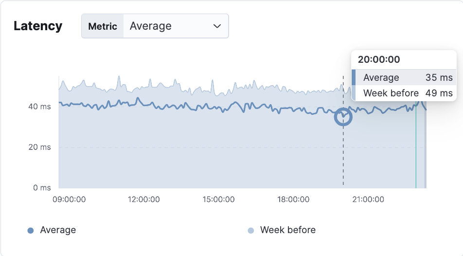
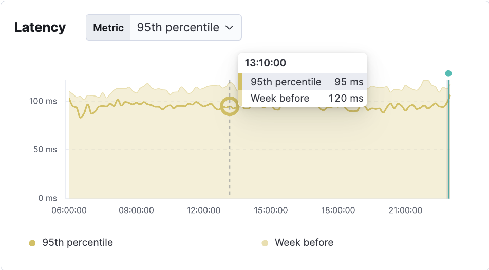
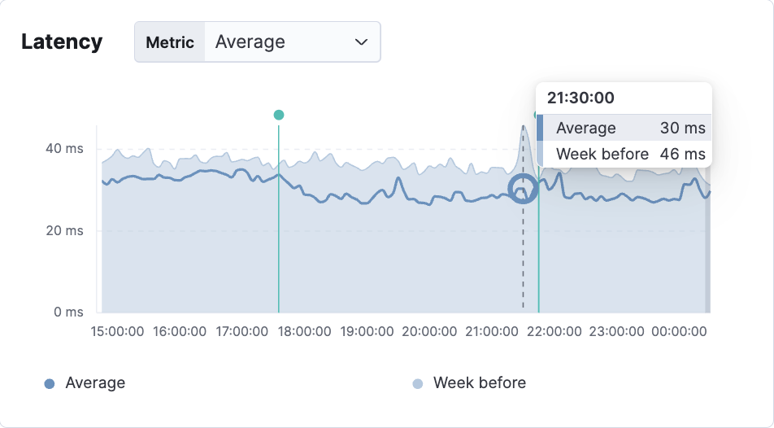

# Redis Cluster Pipeline Library with 

This is a custom wrapper around the [ioredis](https://www.npmjs.com/package/ioredis) that adds a new method `clusterPipeline` to handle Redis Cluster pipelines more efficiently.

## Why This Library?

### Problem at PhysicsWallah

At PhysicsWallah, we needed an efficient way to handle Redis Cluster commands when multiple Redis nodes were involved. The standard ioredis pipeline approach didn't take slot distribution into account, leading to inefficiencies and complexity. We developed this library to:

- Enables the execution of Redis pipeline commands across a Redis Cluster.
- Maintain the order of results while executing commands in parallel.
- Make our Redis Cluster usage more efficient and less error-prone.

## Limitations of ioredis in Clustered Redis Topology

As stated in the official [ioredis documentation](https://github.com/redis/ioredis?tab=readme-ov-file#transaction-and-pipeline-in-cluster-mode):

> "All keys in a pipeline should belong to slots served by the same node, since ioredis sends all commands in a pipeline to the same node."

This means that when executing multiple commands in a pipeline, all keys must belong to the same Redis slot, as `ioredis` sends the pipeline commands to a single node. If the keys interact with different shards, pipeline commands would fail with error.

Due to this limitation, pipelining cannot be reliably used in Redis clusters with ioredis, leading to increased network latency as each command is executed individually instead of being batched together.

Our custom library resolves this issue by enabling efficient and reliable pipelining support in clustered Redis environments, improving performance and reducing latency.

## Features

- **Efficient Redis Cluster Pipeline**: Adds support for executing commands across multiple Redis Cluster nodes using `clusterPipeline`.
- **Seamless Integration**: Works with the existing ioredis client without requiring any changes to your existing Redis configuration.
- **Cluster-Aware**: Automatically handles Redis commands based on slots, distributing them across the appropriate Redis Cluster node.
- **Backward Compatible**: All existing ioredis functionality is preserved; the `clusterPipeline` method is simply added to the Cluster class.

## Installation

To install the library, use npm or yarn to add it to your project.

```bash
npm install @pw-tech/pw-redis
```

Or with yarn:

```bash
yarn add @pw-tech/pw-redis
```

## Usage

After installing, you can use the Cluster class just as you would with ioredis, but with the added functionality of the `clusterPipeline` method for Redis Cluster commands.
```javascript
clusterPipeline(commands: [string, ...any][]): Promise<[error: Error | null, result: unknown][] | null>
```

##### Parameters:

- `commands`:  An array of Redis commands, where each command is represented as an array with the command name as the first element, followed by its respective arguments.
  - Example:  [['set', 'key1', 'value1'], ['get', 'key1']].

##### Returns:

- A Promise that resolves to an array of results for each command, in the same order as the input.
  - Example: [ ['OK'], ['value1'] ].

#### Examples

1. Cluster Redis Usage

When working with Redis Cluster, you can use the clusterPipeline method to efficiently handle multiple commands across different nodes.

```javascript
import { Cluster } from '@pw-tech/pw-redis';

const clusterRedis = new Cluster({
  redisOptions: [{ host: 'localhost', port: 6379 }],
});

const commands = [
  ['set', 'key1', 'value1'],
  ['get', 'key1'],
];

clusterRedis.clusterPipeline(commands)
```

And the output will be:

```javascript
[[null,"OK"],[null,"value1"]]
```


2. Normal Usage

```javascript
import { Redis } from '@pw-tech/pw-redis';

const redis = new Redis({
  host: 'localhost',
  port: 6379,
});

redis.set('key1', 'value1').then(() => redis.get('key1')).then(console.log);
```

## Explanation of `clusterPipeline`

The `clusterPipeline` method takes an array of Redis commands (e.g., [['set', 'key', 'value'], ['get', 'key']]) and automatically distributes them across the appropriate Redis Cluster nodes based on key slots. It executes the commands in parallel, ensuring that the results are returned in the same order as the input commands.

## How it Works

- **Slot Calculation**: Redis Cluster distributes keys across multiple nodes using hash slots. The library automatically determines the correct node for each key and groups commands accordingly, using the Redis `SHARDS` method to map and store the slot-to-node mapping in memory. In case of any slot changes in Redis, detected through error handling, the slot ranges are refreshed dynamically.
- **Pipeline Execution**: Once the commands are grouped by node, they are executed in parallel, improving performance when processing large sets of commands.
- **Result Handling**: The results from each node are collected and returned in the same order as the original set of commands, ensuring consistency and ease of use.

## Performance Improvement in Production

After implementing partial pipeline optimization, we observed significant API response time improvements in production. Some queries had to remain sequential due to business logic dependencies, but wherever possible, parallel and pipeline execution were combined.

### API 1

| Date       | Avg Latency | P95 Latency | P99 Latency |
|------------|-------------|-------------|-------------|
| Without Pipeline  | 52ms        | 119ms       | 264ms       |
| With Pipeline     | 42ms (↓19%) | 101ms (↓15%)| 224ms (↓15%)|

#### Latency Comparison
<p align="center">
  
</p>
<p align="center">
  
</p>
<p align="center">
  
</p>

### API 2

| Date       | Avg Latency | P95 Latency | P99 Latency |
|------------|-------------|-------------|-------------|
| Without Pipeline | 36ms        | 78ms        | 234ms       |
| With Pipeline    | 31ms (↓14%) | 57ms (↓27%) | 202ms (↓13%)|

#### Latency Comparison
<p align="center">
  
</p>
<p align="center">
  
</p>
<p align="center">
  
</p>

## Key Learnings & Next Steps
- **Pipeline execution improved response times** significantly in cluster mode.
- **Sequential logic in APIs limits optimization**, we will continue identifying more queries for batching.
- **Next Steps**: Expanding this approach across more APIs & optimizing Redis cluster configurations.

## License

This library is open-source and licensed under the MIT License.

## Contributing

If you have any improvements or bug fixes, feel free to submit a pull request or open an issue.